# Overview

This repository contains the instructions for how to run the medical image processing pipeline, which is currently centered on Vivek's AWS account. 

These instructions are provided to run the pipeline from the AWS Console Dashboard. There is also a way to run the pipeline from the command line on Linux and MacOS that we will provide later.

### Steps

1. Setting up your AWS credentials on Vivek's AWS Account
2. Preparing the training data and labels 
3. How to run a segmentation version of the pipeline.

### Pipeline Solutions:

The pipeline will eventually be fully fleshed out to handle the following medical image processing problems:

* Segmentation of tumors or general ROIs (regions of interest)
* Patient outcome/survival prediction - prognosis
* Determination of best treatment/therapy
* Computer-Aided Diagnosis

# Setup AWS credentials on Vivek's AWS Account

### Ask Vivek for AWS Credentials

Email vivek.swarnakar@ucsf.edu to ask for a username and a password. You also need access to the following AWS services:

* AWS Lambda - read access
* AWS Simple Storage Service (S3) - read and write access
* AWS Simple Queue Service (SQS) - read and write access

### Sign in to Vivek's AWS Account

To sign in, begin by visiting: https://314083849514.signin.aws.amazon.com/console 

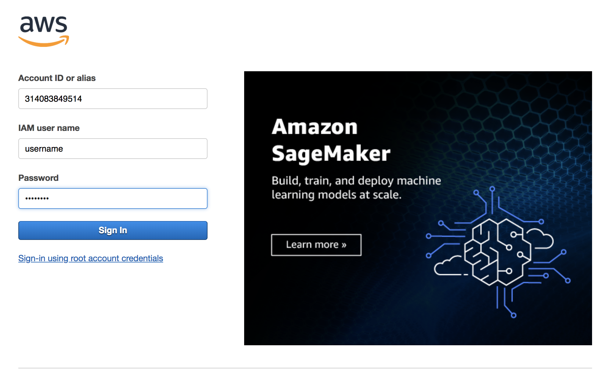

# Preparing the training data and labels

### Navigate to AWS Simple Storage Service (S3) interface

After logging in you will arrive at a launch page of various AWS services.

Before we talk about actually running Lambda functions, the pipeline requires the training data and labels to be uploaded to the cloud, and we currently support S3 buckets or Dropbox folders. It doesn't matter what the S3 bucket or Dropbox folder is called, as you can specify to the pipeline which bucket or folder to look at. In this tutorial, we will focus on S3 (we plan to deprecate support for Dropbox sometime in the near future).

To navigate to the S3 interface, click the button highlighted below:

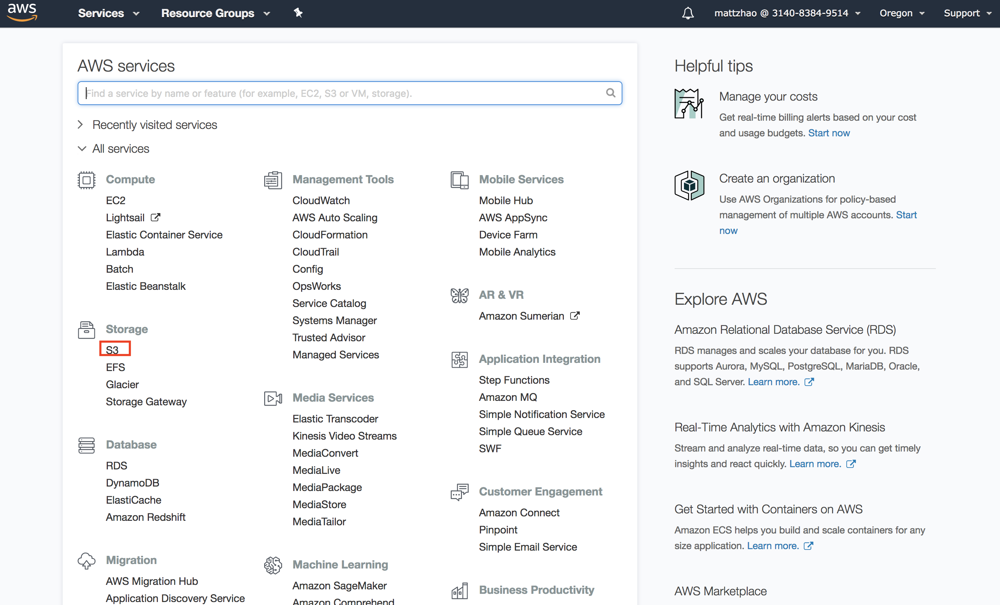

After clicking the S3 button, you should arrive at a page like this:

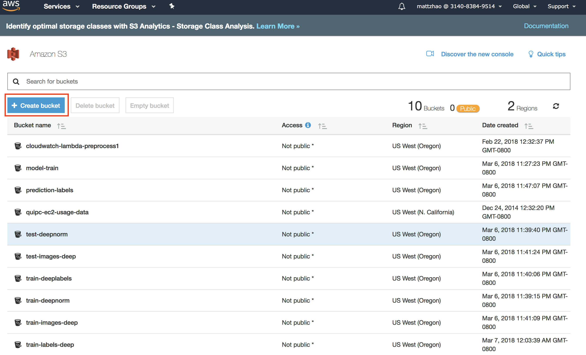

### Create an S3 bucket for training

Now we have two options: you can either use an existing empty bucket for the training data (such as train-images-deep) or you can create a new bucket to store them in. If there is already a dataset/labels csv in the train-images-deep bucket, you should create a new bucket. Otherwise, you can use the train-images-deep bucket and upload all your images (and labels if single) there. We will go into detail on how to create a new bucket and upload your training images into it (if you are using an existing bucket, skip directly to "Upload images to S3 bucket").

In the screenshot above, I've highlighted in red the box that you must click to create a New Bucket. 

After getting to the "Create bucket" interface, type your desired bucket name (the only rule for creating this bucket is that it must not already exist and you should easily be able to pass it in to your Lambda function, it is recommended that the name of the bucket is self-explanatory). You should also create the bucket in the same region that the rest of your AWS services reside in (in this case, US West - Oregon). 

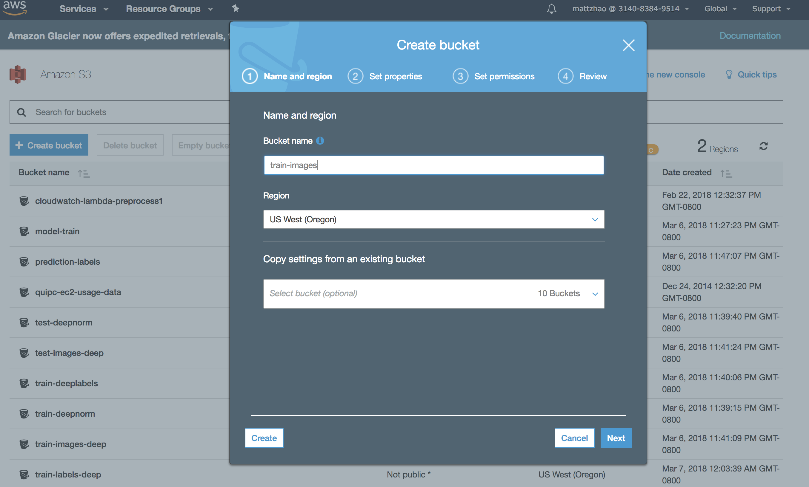

After clicking the "Next" button to configure your newly created bucket, you will see a screen like below, with many properties that you can set. You can leave the default settings for now.

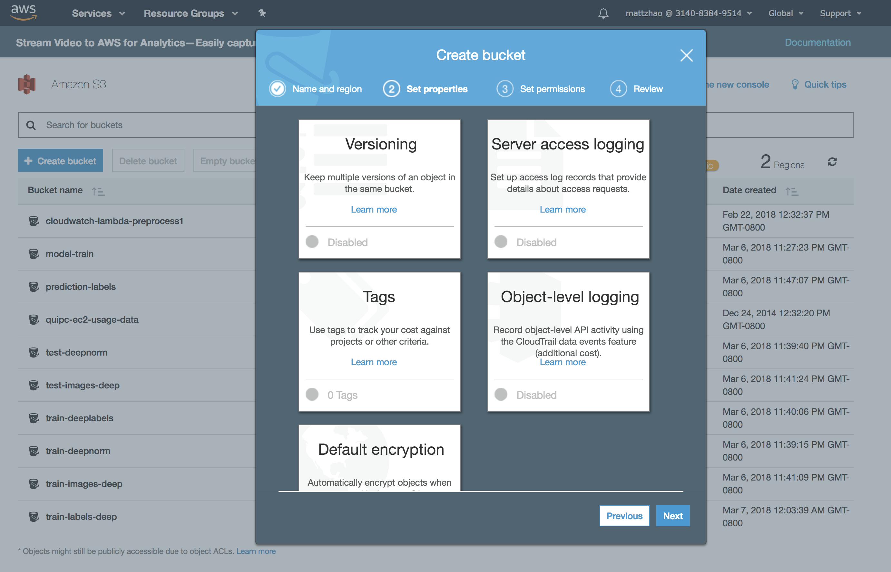

After clicking the "Next" button again, you will see the screen where you can manage users and permissions for the bucket. You should add yourself (the user ID that you use to login to Vivek's AWS account) to the "Access for other AWS Account" section and give yourself all permissions. Click "Save". Other than that, please leave the other permissions set to default, especially public permissions. We do NOT want the public to be able to access patient data. 

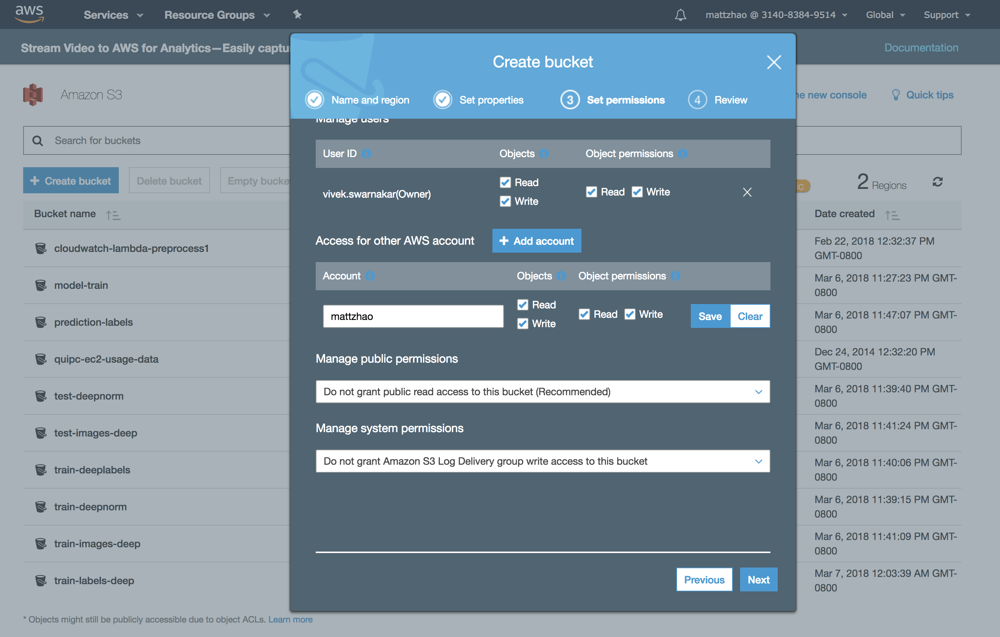

After clicking the "Next" button, you'll be taken to a Review of the settings you used to create the new bucket. If everything looks good, click "Create Bucket" to finish the process.

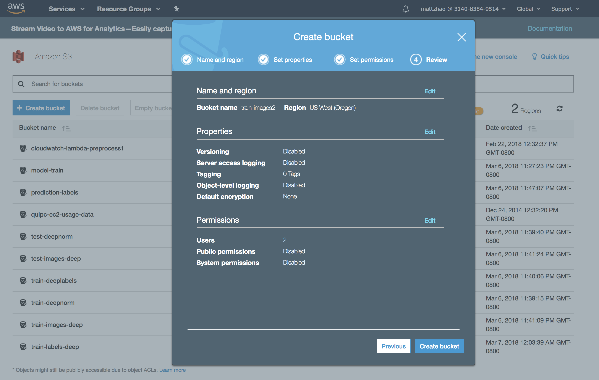

Congratulations! You have created a bucket for your training images! You are going to want to repeat these steps to create a bucket for your training labels, your testing images, and your testing predictions/inferences (these are the results your model outputs for your testing images). There is already a bucket that's been created for all the models, so it's likely you're just going to want to use that for model storage (called "model-train"). All other intermediate storage buckets should already have been taken care of.

### Upload images to S3 bucket

If your training data has single labels (aka your problem is a supervised learning problem - https://en.wikipedia.org/wiki/Supervised_learning), then you must place your labels into csv format and place it in an S3 bucket (if you previously used S3 for your training images, then place the labels in the same folder). The CSV should have two columns: the first column should have the title "image" and the second column should have the title "level". Under the first column, you should place the name of the image without the file extension (e.g. if your image was named `ct_scan_1.dicom`, then in the csv, this would translate to `ct_scan_1`). Under the second column, you should place the label associated with the image. Also, keep in mind that when you run the Lambda pipeline, you must indicate that you are using "single" labels. We will go over this in more detail below.

If your training data has multiple labels per datapoint (e.g. you may have extracted image patches from each image in your dataset and have separate labels for each patch), then you would place your labels in a separate training labels bucket. In this case, it is necessary for you to order the labels in a .npy file describing a numpy array and the names of the label file and its corresponding image (doesn't include the file extension, just the name before the extension) have to match.

The below screenshot describes what a valid .csv file could look like:

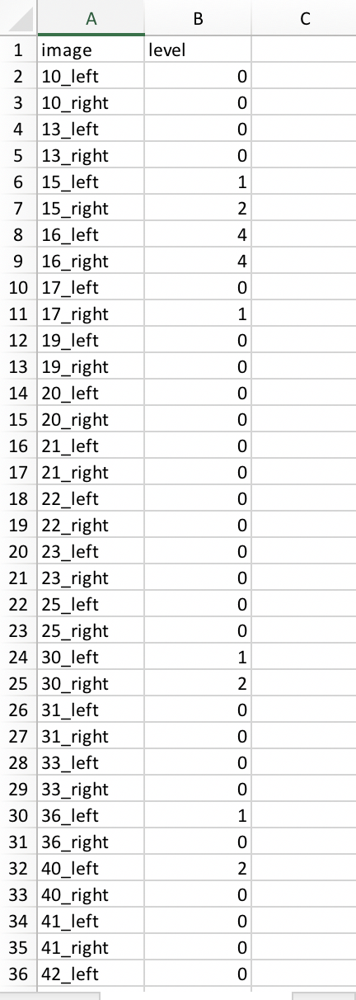

The images should be in either .dicom format (the common medical image format) or a common image format (.png, .jpg, etc). If an image is not in one of these formats, we cannot guarantee that the pipeline will be able to analyze the image correctly as of now.

To upload the images and the CSV file in a bucket, click the bucket you created for storing the training images and you should see something like below (your screen likely will show "Nothing in bucket" rather than the csv I have):

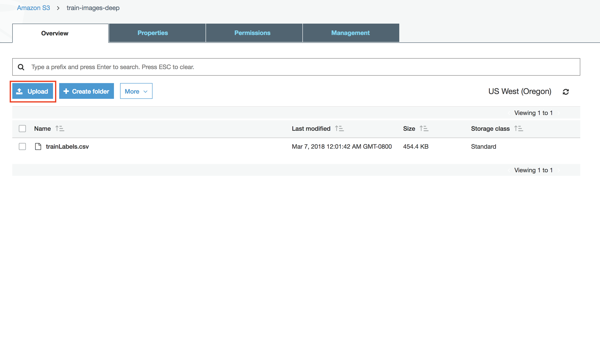

To upload, click the "Upload" button (boxed in red in above screenshot). Either drag and drop or click "Add Files". Select the images you want to upload (our pipeline currently can't support uploading whole folders with images in them or compressed zipfiles with images in them). 

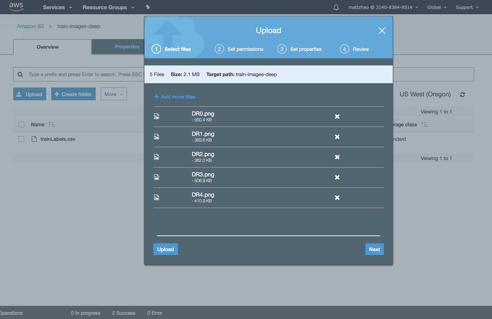

After clicking "Next", you should see the interface for setting permissions and managing users. Again, leave the "Manage public permissions" setting to "Do not grant public read access", and add your user ID for Vivek's AWS account in the "Access for other AWS account" section.

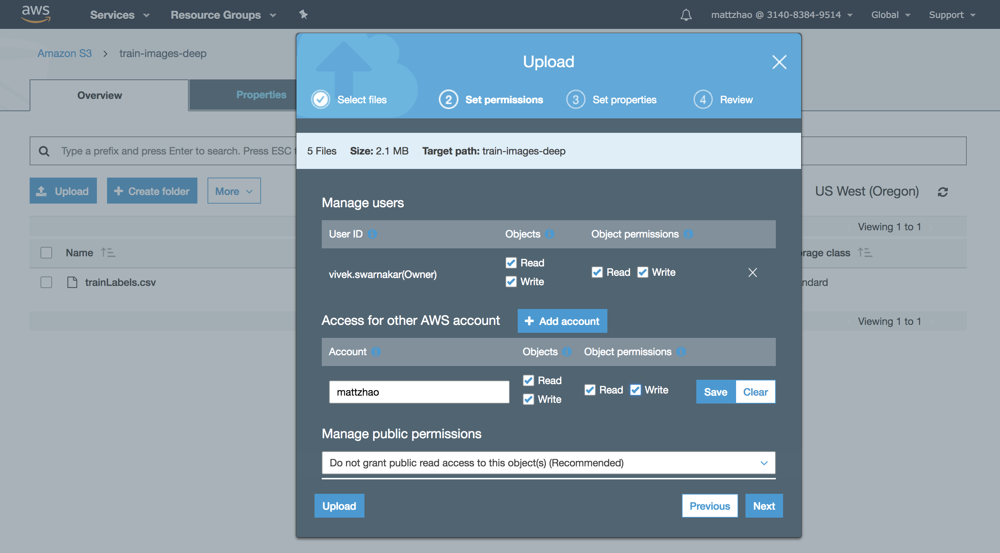

After clicking "Next", you should see the interface for setting other properties. You can leave all of these blank/on-default, but if you have a lot of free time, it would be good to take a look at https://docs.aws.amazon.com/AmazonS3/latest/dev/storage-class-intro.html to understand which kind of storage class you want to use for your objects. Also, if you are dealing with highly sensitive patient data, it may be good to encrypt your training images/labels (https://docs.aws.amazon.com/kms/latest/developerguide/services-s3.html). 

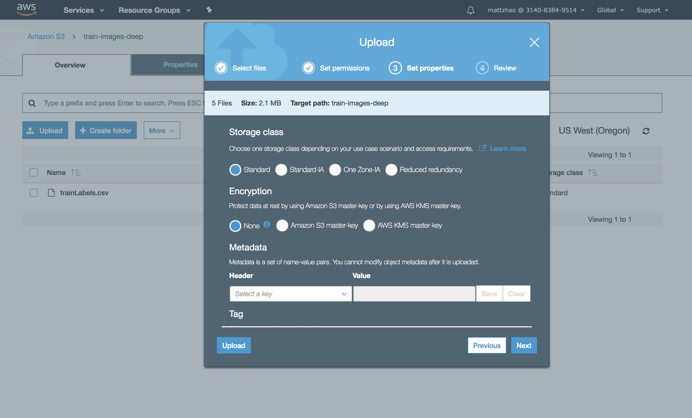

After clicking "Next", you'll again be brought to a review of the settings (we won't show this because it was already shown in bucket creation and it's very similar). Click "Upload" if everything is good.

NOTE: if Uploading is failing, retry all the steps of uploading the images, but do not add your user ID to "Access for other AWS accounts" in the permissions interface. This seems to be a bug with S3.

### Navigate to AWS Lambda interface

Every month, each AWS Account (in this case Vivek's) has a free tier for AWS Lambda functions. There are 400,000 GB-seconds of free compute time and 1,000,000 free executions of Lambda functions. 

First, return to the AWS Console Dashboard. Our pipeline is primarily made up of serverless computing functions, so we want to look at the AWS Lambda service. To navigate to the Lambda interface, click the button highlighted below:

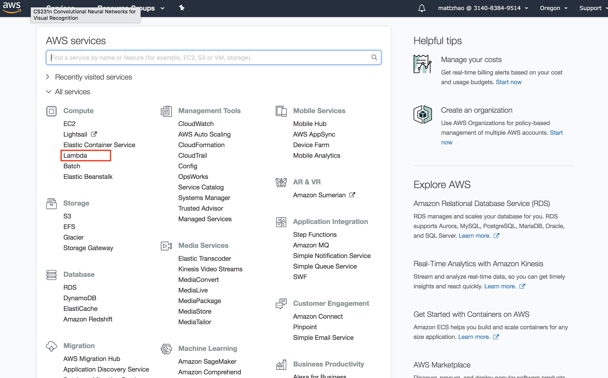

You should now see a page like this:

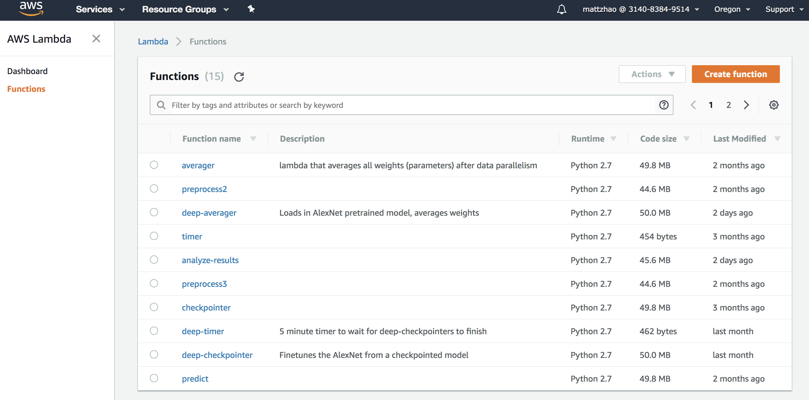

Here you can access all the Lambda functions under Vivek's account. This will include the ability to download the source code and its dependencies for each Lambda function. If you have write access, you will also be able to edit functions and change their configurations (max memory allocated, environmental variables, VPC networks, time limit, etc) For more general information about Lambda, see Amazon documentation here: https://aws.amazon.com/lambda/ 

### Update AWS region

We have specifically created this pipeline for the `US West (Oregon)` AWS region of service. To ensure that the pipeline works as efficiently as intended, make sure you are in the `US West (Oregon)` region of service by changing the context in the top right hand corner of the banner as needed:

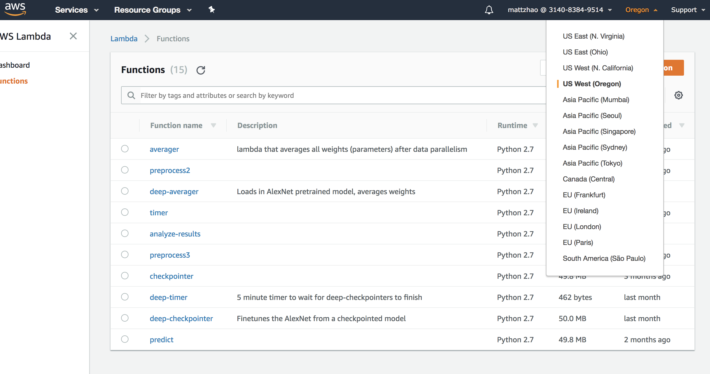

### Pipeline Overview

Before we go into further steps, it would help to gain an understanding of the basic architecture of the pipeline. The below diagram shows the overview of the pipeline:

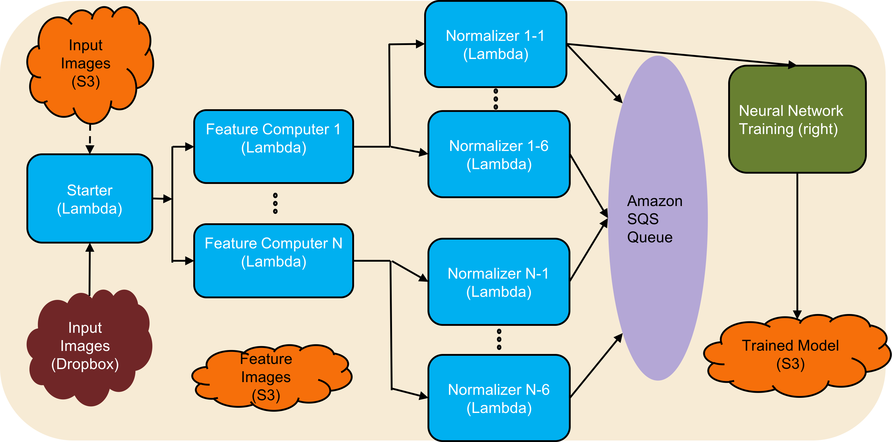

This diagram primarily focuses on the preprocessing steps of the pipeline, and then packages the actual training of the model to analyze the images into a black box. There are also two versions of the pipeline, we will call the original version the non-deep learning pipeline. This essentially means that the training process uses a fully connected neural network with only 1 hidden layer (a multilayer perceptron neural network). However, there are very few situations where this is useful in state-of-the-art computer vision. Therefore, the newer version, called the deep learning pipeline, is a convolutional neural network (usually classified as being a "deep learning technique"), which is the new standard for learning in computer vision. 

The Starter Lambda function is the only Lambda function that users interact with in the pipeline (besides the function to analyze results). It is responsible for associating labels with a specific image (which have either been uploaded to S3 or dropbox) asynchronously calling 

NOTE: the names of the Lambda functions in the diagram are misleading. Starter Lambda is actually called preprocess1 (the deep learning version is called deep-preprocess1), Feature Computer Lambda is actually called preprocess2, Normalizer Lambda is actually called preprocess3 (the deep learning version combines these two together into deep-preprocess2). 

Let's now take a look at the training steps:

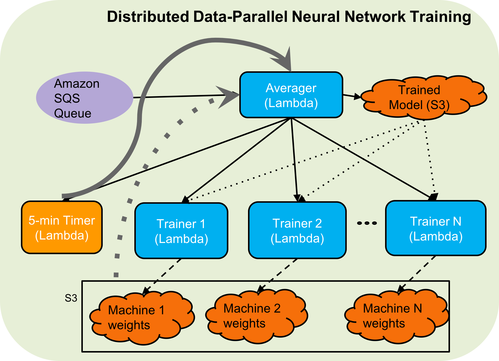

In this diagram, we see how the training works. Because each execution of a Lambda function has a 5-minute limit, we had to save the model into a Tensorflow checkpoint file after training for 5 minutes and then upload the files to S3. When we ready to train again, we can then download the model from S3, load it into the graph session, and retrain. However, because this process is very time-consuming, we take advantage of the massive parallelization that Lambda provides and train the model with a distributed, data-parallel approach, meaning that at each iteration/epoch, we train the model n times on n separate Lambda Trainer functions, each of which gets 1 image to train on. After training, each function will generate a new set of weights, which are uploaded to S3. Since each Lambda function can only run for 5 minutes, we synchronize the updates in a brute-force method by setting a timer that waits 5 minutes after all the trainer functions have been called. At the end of the timer, the Averager Lambda will be called which takes each set of weights trained by the Trainer functions on S3 and averages across corresponding matrices to produce an averaged set of weights that is then uploaded to S3 for the next iteration of Trainer functions to use. This method of training is equivalent to training proof articulated in https://blog.skymind.ai/distributed-deep-learning-part-1-an-introduction-to-distributed-training-of-neural-networks/ is equivalent to training all n images in one minibatch on one machine, as long as we ensure that the averaging step occurs at every minibatch trained (we average after every parallel set of Trainer functions) and that we are only using Stochastic Gradient Descent (and not RMSProp, momentum, or Adam) as our optimization algorithm.

For those machine learning experts out there, we specifically use an AlexNet model that has been pretrained on ImageNet images, and we reinitialize and finetune the last 3 fully-connected layers to the medical image dataset. 

NOTE: again, the names are misleading. Trainer Lambda is actually called checkpointer (the deep learning version is called deep-checkpointer). However, Averager Lambda is named as so in Lambda (called deep-averager in deep learning version) and Timer Lambda is also named as such (called deep-timer in deep learning version).

### Accessing and running the pipeline

Now that we have a basic understanding of the pipeline, we can continue with the tutorial. The functions required to run basic versions of the pipeline have already been created, so it is not necessary to create them.

First, as we mentioned above, both versions of the pipeline start with the Starter function, which is called preprocess1 in the Lambda interface (deep-preprocess1 for the deep learning version). If you scroll through the pages in Lambda, you should find such functions like below.

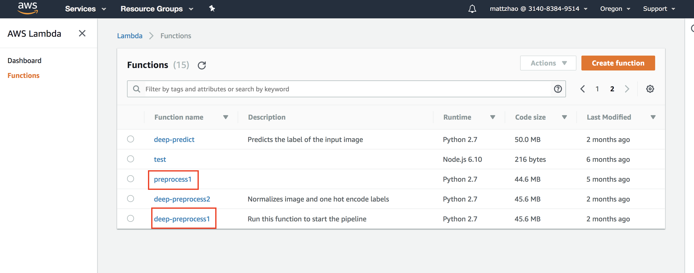

After clicking on the function, you will see an interface like this:

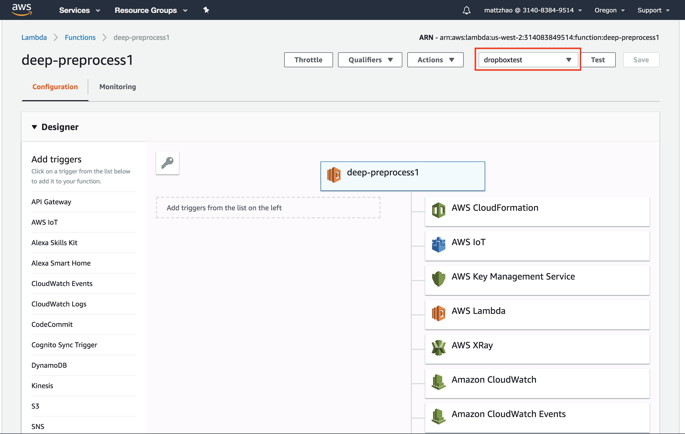

Unless you need to upload new code or change settings (such as how much memory you want to allocate to the function, how long before the function times out, environment variables, VPCs, etc), you can simply just run the function. To do that, first we must configure the test event. Click the dropdown highlighted in red in the picture above, and then select "Configure test events".

NOTE: Like I mentioned before, this is not an "official" way to run the pipeline. The official way would be to call the Lambda functions from a CLI or from a GUI that we make that will invoke the function. As of now, we don't have a GUI and calling it from AWS CLI would take a lot of extra steps, so we'll keep it simple for now.

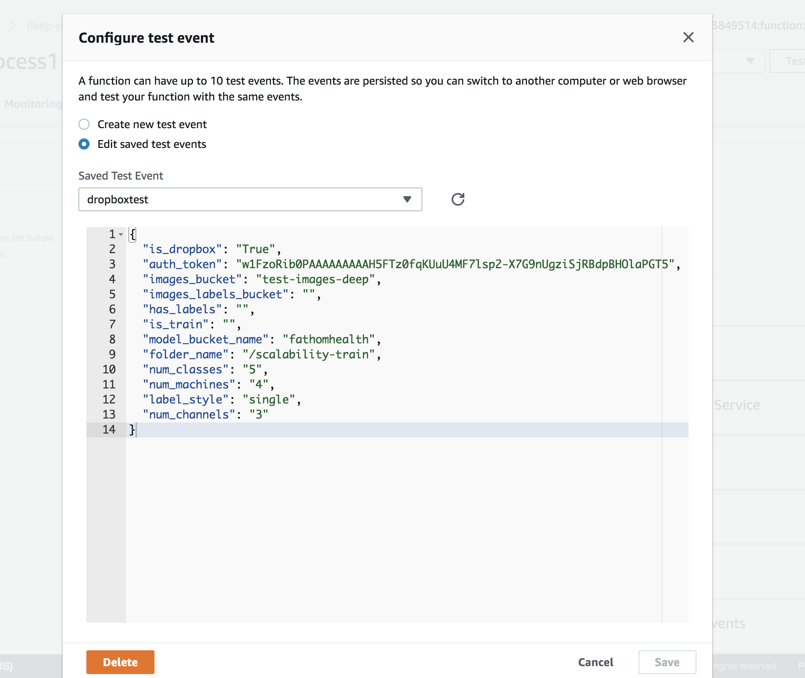

You can either edit the current saved test event, or create your own. Keep in mind that each web browser on each computer can only have 10 test events. Let's create our own. To do so, select the "Create New Test Event" radio button. It'll likely use a previously saved test event as a template, which is fine. Otherwise, the Event Template will likely be set to Hello World. It doesn't really matter what it's set to, as long as we customize it with the right arguments.

You'll want to fill in the "Event name" textbox with whatever you want to call the test event. Try to make it easy to understand. In the actual test event text, the following arguments need to exist (not all of them are required for every event depending on train/test time, but we'll fill all of them in for now) - there ARE NO DEFAULTS, they must all be given inputs:

* is_dropbox - takes in either empty string "" as False or non-empty string as True (in our case, since we put images in S3, set it to empty for False)
* auth_token - takes in the auth token that allows the Lambda function to access your dropbox with images (since we don't use dropbox, set it to empty string "")
* folder_name - takes in the path to the directory that stores the training/testing images from the root directory of your Dropbox account (again leave this empty string)
* images_bucket - the name of the bucket you just created (or that you put your training images in) in S3 in the above section
* is_train - whether you are running the pipeline for the purpose of training a model or running a model through testing data for inference predictions
* has_labels - whether your data has labels or not, empty string if False and non-empty string if True (NOTE: there are two cases when this would not be the case: testing data and unsupervised training data)
* label_style - whether your labels are "single" (scalar value per training image) or "array" (matrix/vector value per training image - a common case would be if you have labels per pixel for segmentation task)
* images_labels_bucket - if your label style is "array", the name of the bucket that you created to store the label matrices/vectors per image, otherwise if your label style is "single", leave empty string
* model_bucket_name - this is a unique string identifier for your model in S3 and SQS, try to make it specific (NOTE: this is named badly, it's not the name of the bucket, but the name of the model IN the models-train bucket)
* num_classes - FOR CLASSIFICATION/PIXEL-WISE CLASSIFICATION (SEGMENTATION) PROBLEMS: the # of label classes that can be assigned to an image
* num_machines - the # of Lambda Trainer functions you want to run in parallel (only applicable in Training)
* num_channels - the # of channels per image (RGB images have 3 channels, grayscale have 1, you might have a 3rd/4th dimension just for these type of things)

Click "Create" to create the test event. You're going to want to create one for training the model, as well as one for inference/predictions. 

Here's an example of training event for reference:

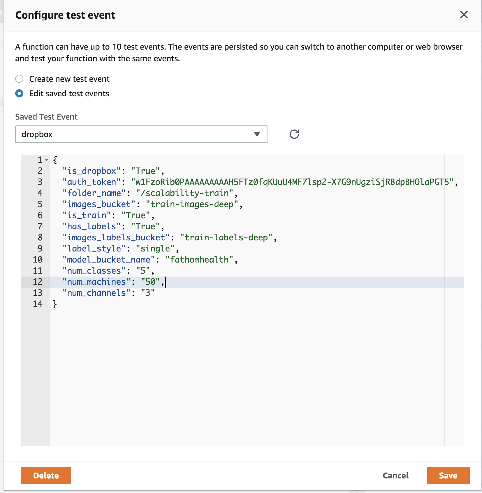

Here's an example of testing event for reference:

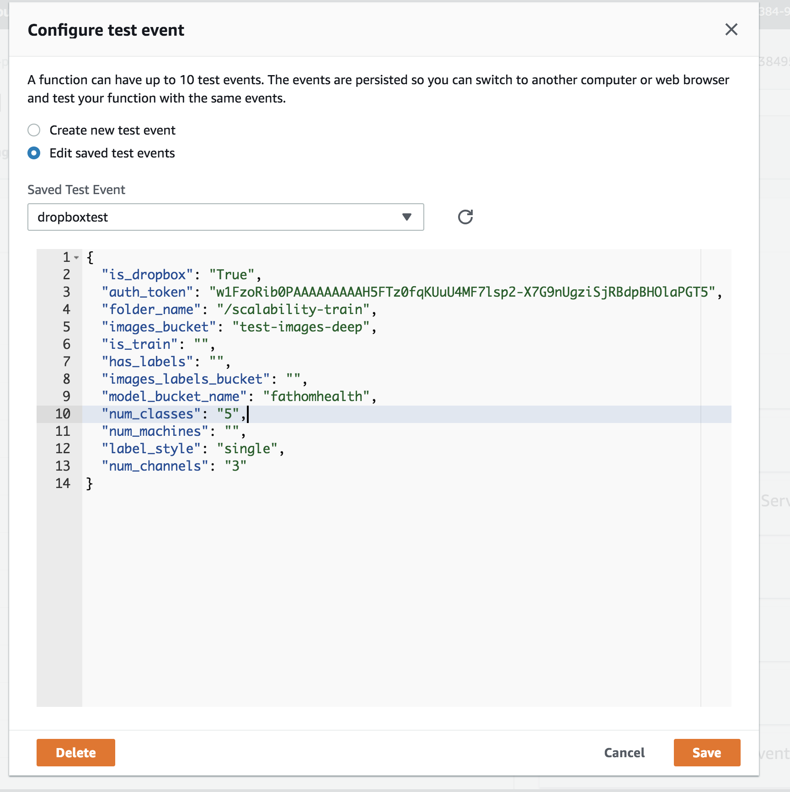

To run the test event, click the Test button highlighted in red in the screenshot below.

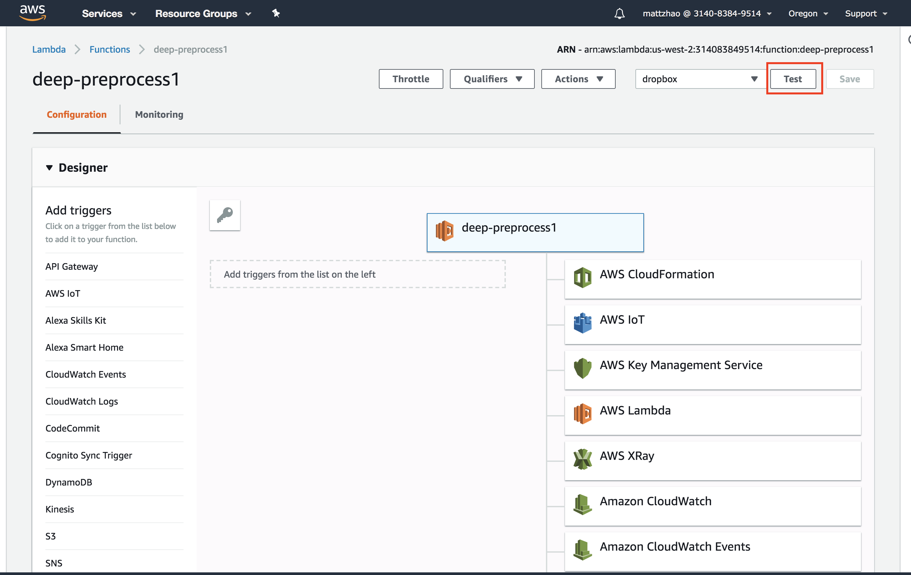

You will then see the function executing like so:

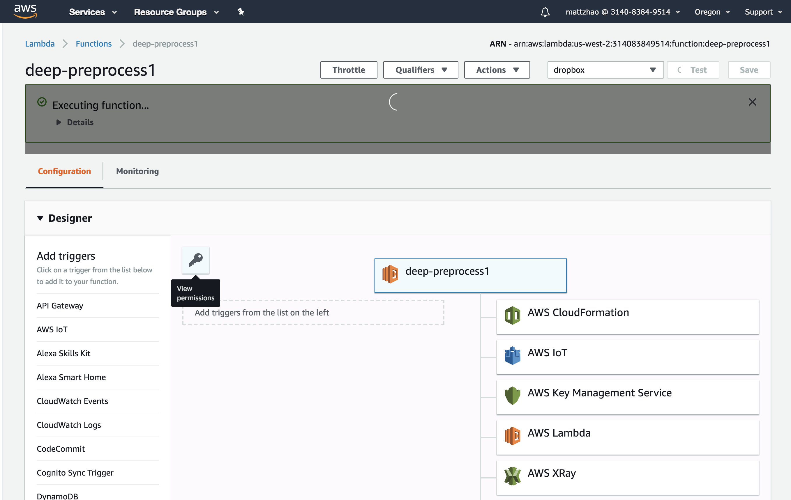

When it is done running, you should see a "Success" screen like so:

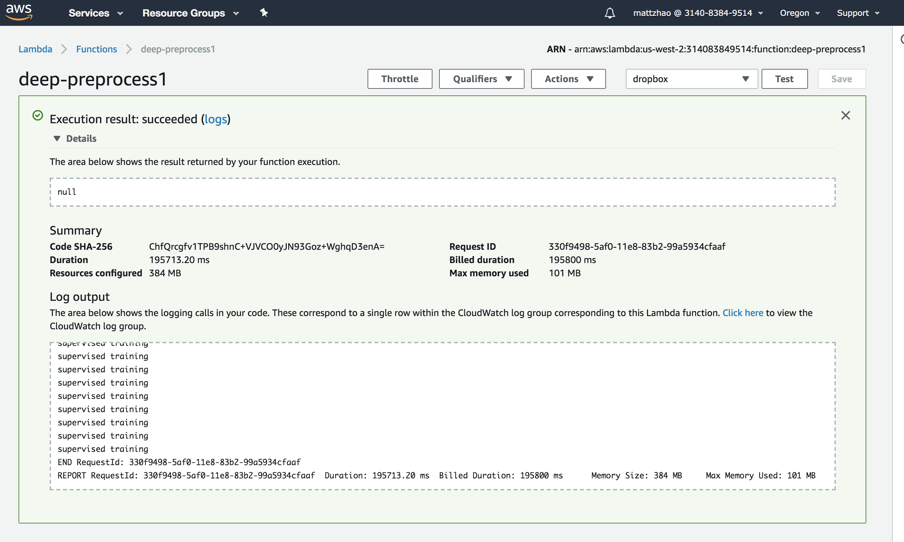

NOTE: If you see an error when executing preprocess1/deep-preprocess1, please report it to Matthew Zhao (matthew.x.zhao@berkeley.edu) with a screenshot of the expanded error.

### Checking CloudWatch Logs for Pipeline Progress

Since all our Lambda functions are run asynchronously, the only way to track what is going on after preprocess1 finishes running is by checking the Cloudwatch Logs. 

If you go to https://us-west-2.console.aws.amazon.com/cloudwatch/, you should see a screen like below. Click on Logs on the left sidebar (highlighted in red below).

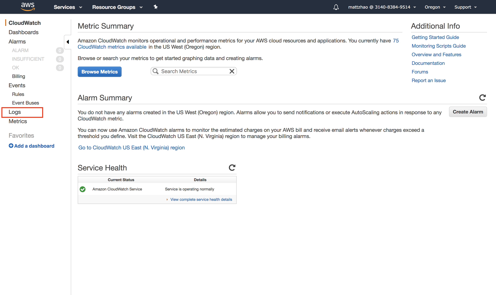

You should now be taken to an area with a list of log groups. In this case, each log group beginning with /aws/lambda is the log group for a specific Lambda function (e.g. /aws/lambda/preprocess2 is the log group for the preprocess2 Lambda function). A log group is made up of several logs, each timestamped with the time they were started (one log in the Preprocess2 log group does not necessarily correspond to one invocation of the Preprocess2 Lambda function, one log may include the results of multiple invocations and one invocation may have its output spread across multiple logs). 

So if you click the log group for preprocess2, you should see a list of log streams for invocations of the preprocess2 Lambda function (whether its done by UI test user event, AWS CLI user input, or automatic invocation from other Lambda functions).

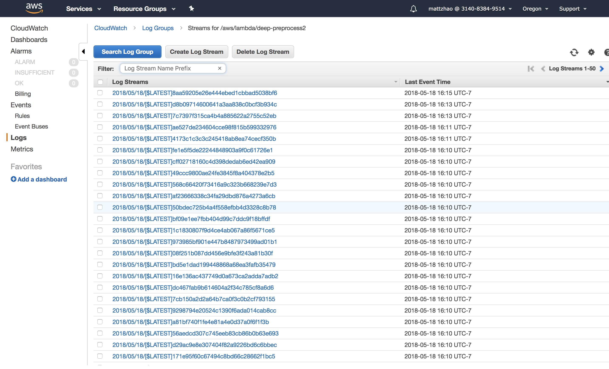

Clicking on any log stream will give you the log results starting at that specific timestamp.

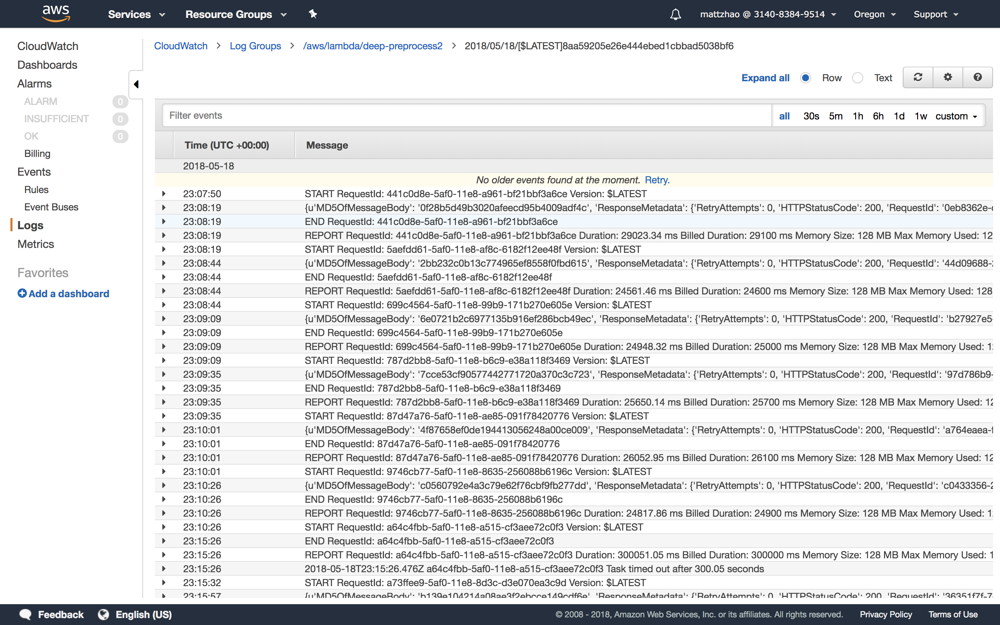

The log stream is made up of several parts

* START RequestID: The first output that appears when that Lambda function is invoked. If there are several invocations in parallel, they will be spread across multiple log streams
* Print statements, your actual log info: This is whatever you choose to output to the logs (print statements in Python do get put here)
* END RequestID: Signals that the specific Lambda function invocation that began with START RequestID has finished running (this does not mean that it finished running without errors)
* REPORT RequestID: Shows Duration of Lambda function run (and how much you were billed for), Memory Size allocated to the Lambda function (user specified at the Lambda function configuration), and Max Memory Used (the actual memory that was used, which may be less than allocated)

If you've exceeded the max memory allocated to the function, then you should allocate more memory to the function in the function configuration. If you've already allocated the max (3008 MB), contact matthew.x.zhao@berkeley.edu.

Clicking on the outputs from the log stream you should see this:

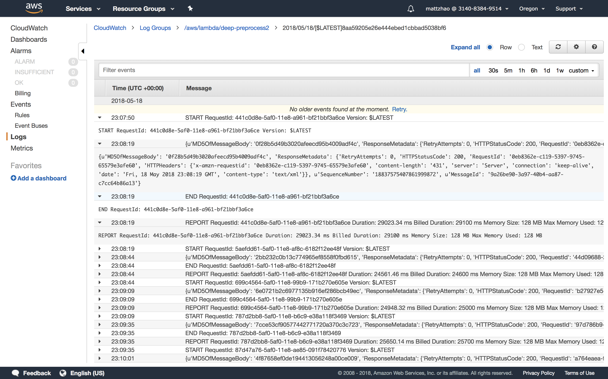

The logs are not easy to read, especially since there are many executions of one Lambda function at the same time (preprocess2/deep-preprocess2 is called on each image). You can essentially ignore most of the log groups, except 

* Averager.py - when you see a "Done" message (with a capital D), then the model has finished training on the data. You can retrieve the model in S3 at the "models-train" bucket. The name of the S3 object with the model is the one you passed in for the "model_bucket_name" argument at the beginning of the pipeline run.

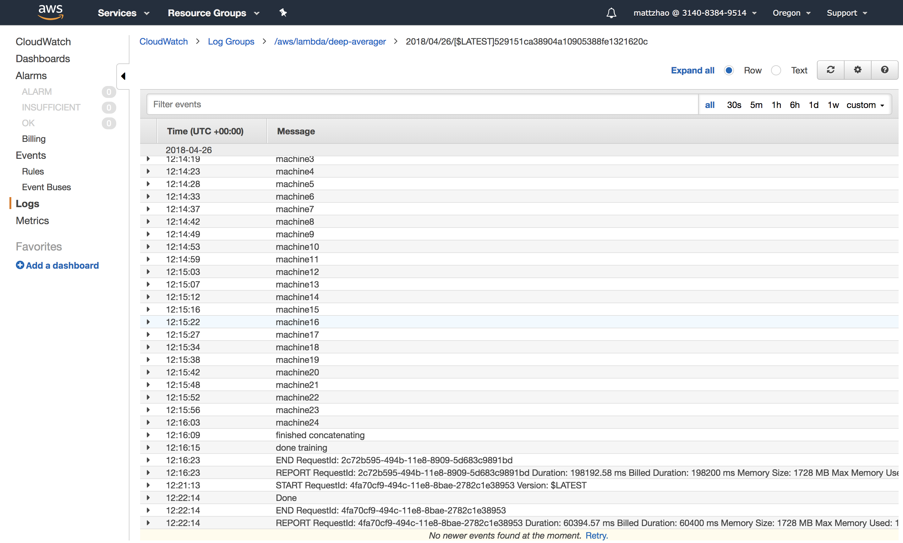

Results are also posted to S3. These will be in the "results" bucket, and each image has an object with the corresponding predicted label.

If you do happen to see errors, please report them to matthew.x.zhao@berkeley.edu.

### Retrieving Results

There is a function that is currently not a part of the automatic part of the pipeline that must be run independently that will take the results that are posted on S3 and calculate some metrics that are useful for evaluating the model. This Lambda function is called "analyze_results" and it takes in the S3 bucket that holds the training labels (either in one .csv file or multiple .npy files that describe the vector labels per image) and the name of the results bucket.

Current metrics that it returns include 

* Jaccard Similarity and Dice Index (for segmentation)
* Confusion Matrices and Raw Accuracy (for classification)
* Precision-Recall (for binary classification)

The results will likely be posted on S3 and then available to see on Cloudwatch as well.
